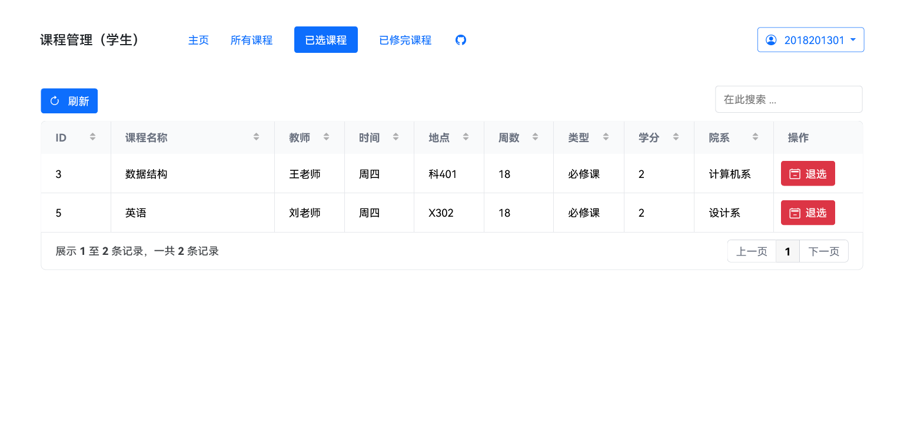

# 一个教务管理系统


来自软件架构课程设计，用 Java 16 + Spring Boot + MyBatis 实现，数据库用的 MySQL 。

前端的代码在 [boring-management-system-web](https://github.com/Lifeni/boring-management-system-web) ，用 SvelteKit 写的。

## 介绍

这是一个简单的教务管理系统，支持以下功能：

- 登录时自动判断身份，无需选择，所有用户可以自行修改密码

- 管理员对课程、学生信息、教师信息进行增删改查，并且可以重置用户的密码

- 教师可以查看自己教的课程，并给学生打分

- 学生可以查看所有课程来进行选课、退课操作，也可以查看出分的课程成绩

### 截图


更多截图点击下面的标题查看。

<details>
  <summary>登录和重置密码</summary>


</details>

<details>
  <summary>管理员（课程、学生、教师和用户的增删改查）</summary>


</details>

<details>
  <summary>教师（查看教的课程并打分）</summary>


</details>

<details>
  <summary>学生（查看所有课程并选课、查看已选并退课、查看成绩）</summary>





</details>


<sub>* 截图中网页字体为 HarmonyOS Sans</sub>
<br />
<sub>** 首页背景图片 Photo
by [TOMOKO UJI](https://unsplash.com/@ujitomo?utm_source=unsplash&utm_medium=referral&utm_content=creditCopyText)
on [Unsplash](https://unsplash.com/s/photos/sakura?utm_source=unsplash&utm_medium=referral&utm_content=creditCopyText") </sub>


## 常见问题

### 运行之后啥也没出现

这是一个前后端分离的项目，后端只提供接口来供前端访问，并没有 JSP 之类的。

如果想要运行网页的前端部分，可以去 [前端仓库](https://github.com/Lifeni/boring-management-system-web)
看看，不过运行需要一定的前端开发经验。

如果不会配前端，也不想学，可以只参考项目中的接口，自己实现前端。

### 接口 404 错误

比如访问 `http://localhost:8080/api/ping` 时出现 404 错误。

**解决方法：** 在接口地址后面加上 `/`，变成 `http://localhost:8080/api/ping/` 。

### 运行时提示版本不对

包括但不限于 IDEA 提示「不支持发行版本」、项目启动不起来、连不上数据库等现象。

**解决方法：** 确保 Java 为 16+，Tomcat 为 9+，MySQL为 5.7+，同时建议使用最新版的 Intellij IDEA 。

####            

## 开发

项目用的是 IntelliJ IDEA，打开之后，应该会有名为 `Start App` 的运行配置，点击即可运行。

### 跨域问题与反向代理

项目采用前后端分离的方式，用 [Caddy](https://caddyserver.com/) 反向代理，因此没有处理跨域问题。

前端的端口是 6010，反向代理到 localhost:3030；后端的端口是 8080，反向代理到 localhost:3030/api/ 。

```shell
# 启动 Caddy
caddy start --config=./build/Caddyfile --watch
```

```shell
# 停止 Caddy
caddy adapt --config=./build/Caddyfile
```

### 数据库

数据库用的是 MySQL 5.7，默认的数据库名是 bms，用户为 root，密码为 password 。

```shell
# 用 Docker 启动数据库
docker run --name mysql-5.7 -e MYSQL_ROOT_PASSWORD=password -p 3306:3306 -d mysql:5.7
```

## 开源协议

MIT License
